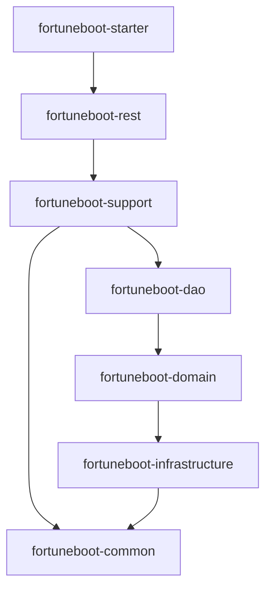

<p align="center">
  
  
  
  
  
  
</p>

<h1 align="center">FortuneBoot v1.5.0</h1>
<h4 align="center">好记 —— 你的家庭财务管家</h4>

---

## 项目简介

FortuneBoot 是一套开源的家庭记账管理系统，支持个人、家庭及小型商户使用。项目致力于提供精简可靠、代码规范的财务管理解决方案。

**核心特性：**
- 支持 **MySQL** 和 **SQLite** 双数据库，SQLite 模式零配置开箱即用
- 支持 **GraalVM Native Image** 编译，启动速度极快、内存占用极低
- 通过 **Flyway** 自动管理数据库版本迁移，无需手动执行 SQL
- **去除 Redis 依赖**（v1.5.0），登录令牌持久化到数据库，部署更轻量
- 支持多平台 Docker 镜像（linux/amd64、linux/arm64）
- 前后端分离架构，前端项目：[FortuneBoot-Ui](https://github.com/shuaichi/FortuneBoot-Ui)

> 官方网站：https://www.fortuneboot.com/
>
> 演示地址：https://demo.fortuneboot.com/ （账号密码：admin/admin123）

---

## 技术栈

| 技术 | 说明 | 版本 |
|---|---|---|
| Spring Boot | 核心框架 | 4.0.5 |
| MyBatis-Plus | ORM 框架 | 3.5.16 |
| Druid | 数据库连接池（MySQL 模式） | 1.2.28 |
| HikariCP | 数据库连接池（SQLite 模式） | 随 Spring Boot |
| Flyway | 数据库版本迁移 | 12.2.0 |
| Spring Security | 安全认证 | 随 Spring Boot |
| SpringDoc OpenAPI | API 文档（Swagger UI） | 3.0.2 |
| Quartz | 定时任务调度 | 随 Spring Boot |
| GraalVM Native Image | 原生镜像编译 | 25.0.2 |
| Hutool | Java 工具库 | 5.8.44 |
| Guava | Google 工具库（缓存实现） | 33.5.0-jre |
| Lombok | 代码简化 | 1.18.44 |
| JJWT | JWT Token 生成与解析 | 0.13.0 |
| ip2region | 离线 IP 地址库 | 3.3.6 |
| POI | Excel 导入导出 | 5.5.1 |
| MySQL Connector | MySQL 驱动 | 8.4.0 |
| SQLite JDBC | SQLite 驱动 | 3.51.3.0 |
| JDK | Java 开发工具包 | 25+ |

---

## 项目架构

### 模块划分

```
FortuneBoot-Server
├── fortuneboot-starter        -- 应用启动入口（Spring Boot Application）
├── fortuneboot-rest           -- REST API 接口层（Controller）
├── fortuneboot-support        -- 业务逻辑层（Service、Model、Repository、策略模式）
├── fortuneboot-dao            -- 数据访问层（MyBatis-Plus Mapper）
├── fortuneboot-domain         -- 领域模型层（Entity、DTO、VO、Command、Query、BO）
├── fortuneboot-infrastructure -- 基础设施层（配置、安全、异常处理、缓存、过滤器）
├── fortuneboot-common         -- 通用工具模块（枚举、工具类、异常定义）
└── sql/                       -- 数据库脚本（已迁移至 Flyway，仅作参考保留）
```

### 模块依赖关系



### 各模块职责

| 模块 | 职责说明 |
|---|---|
| `fortuneboot-starter` | Spring Boot 启动类 `ApplicationStarter`，打包入口，GraalVM Native Image 配置 |
| `fortuneboot-rest` | HTTP 接口定义，按 `common`（登录/文件）、`fortune`（记账业务）、`system`（系统管理）分包 |
| `fortuneboot-support` | 核心业务逻辑，包含 Service 层、领域模型（Model/Factory）、Repository 接口与实现、缓存服务、权限服务、账单策略模式、定时任务 |
| `fortuneboot-dao` | MyBatis-Plus Mapper 接口，按 `fortune`（记账）和 `system`（系统）分包 |
| `fortuneboot-domain` | 领域对象定义：Entity（数据库实体）、DTO/VO（数据传输）、Command（写操作入参）、Query（查询入参）、BO（业务对象） |
| `fortuneboot-infrastructure` | 基础设施：数据源自动配置（MySQL/SQLite 切换）、Flyway 迁移、Spring Security 配置、全局异常处理、XSS 过滤、API 前缀重写、限流注解、GraalVM Native 适配等 |
| `fortuneboot-common` | 通用基础：响应体封装、分页查询基类、枚举定义、错误码、国际化、IP 工具、Jackson 工具、文件上传工具等 |

---

## 功能模块

### 记账功能

| 功能 | 说明                                     |
|---|----------------------------------------|
| 分组管理 | 记账的组织单位，一个组包含用户、账户、账本                  |
| 账户管理 | 对应现实中的银行卡、钱包等存钱场所，支持账户余额调整             |
| 账本管理 | 类似生活中的账簿，一个账本下包含分类、标签、交易对象、账单          |
| 分类管理 | 划分和归集交易的框架，支持树形结构，是统计报表最重要的维度          |
| 标签管理 | 给账单打标签，支持标签关联管理，方便筛选特定特征的账单            |
| 交易对象管理 | 映射现实中的收款/付款对象（如：京东商城、支付宝等）             |
| 账单管理 | 核心交易记录，支持 6 种账单类型（收入、支出、转账、调整、垫付、报销等）  |
| 币种管理 | 多币种支持，内置全球主流币种模板                       |
| 归物（GoodsKeeper） | 记录物品持有信息，计算日均/次均使用成本                   |
| 周期记账 | 通过 Quartz + CRON 表达式实现定时自动记账，支持补录和恢复机制 |
| 单据管理 | 创建报销单/借款单，关联多笔账单，便捷管理报销流程              |
| 统计报表 | 分类统计、标签统计、交易对象统计、趋势分析、资产负债概览           |
| 回收站 | 账户、账本、分类、标签、交易对象支持软删除，需先移入回收站再彻底删除     |
| 文件管理 | 支持账单关联文件/图片上传                          |

### 系统管理

| 功能 | 说明 |
|---|---|
| 用户管理 | 系统用户配置，支持用户注册事件驱动初始化 |
| 角色管理 | 角色权限分配，支持数据权限（全部数据/仅本人数据） |
| 菜单管理 | 系统菜单与按钮权限配置 |
| 参数管理 | 系统动态配置项管理 |
| 通知公告 | 系统通知与公告信息管理 |
| 操作日志 | 记录系统操作日志，支持查询与导出 |
| 登录日志 | 记录登录行为，包含登录异常信息 |
| 在线用户 | 活跃用户状态监控，支持强制下线 |
| 服务监控 | 查看系统 CPU、内存、磁盘、JVM 等运行信息 |
| API 文档 | 基于 SpringDoc 自动生成 Swagger UI 接口文档 |

---

## 快速开始

### 环境要求

- **JDK 25+**（推荐使用 GraalVM JDK）
- **Maven 3.9+**
- **MySQL 8.0+**（可选，也可使用 SQLite 零配置启动）
- **Node.js 18+**（仅前端开发需要）

### 方式一：MySQL 模式启动

1. **克隆代码**
   ```bash
   git clone https://github.com/shuaichi/FortuneBoot-Server.git
   cd FortuneBoot-Server
   ```

2. **配置数据库**

   编辑 `fortuneboot-starter/src/main/resources/application-dev.yml`，修改数据库连接信息：
   ```yaml
   spring:
     datasource:
       druid:
         url: jdbc:mysql://localhost:3306/fortune_boot?useUnicode=true&characterEncoding=utf8&zeroDateTimeBehavior=convertToNull&rewriteBatchedStatements=true&useSSL=true&serverTimezone=GMT%2B8
         username: root
         password: your_password
   ```

   > 无需手动导入 SQL！项目使用 Flyway 自动创建表结构和初始化数据。

3. **编译并启动**
   ```bash
   mvn clean install -DskipTests
   ```
   找到 `fortuneboot-starter` 模块中的 `ApplicationStarter` 类，直接运行即可。

4. **启动成功标志**
   ```
    ____   _                _
   / ___| | |_  __ _  _ __ | |_   _   _  _ __
   \___ \ | __|/ _` || '__|| __| | | | || '_ \
    ___) || |_| (_| || |   | |_  | |_| || |_) |
   |____/  \__|\__,_||_|    \__|  \__,_|| .__/
                                        |_|
   ```

### 方式二：SQLite 模式启动（零配置）

修改 `fortuneboot-starter/src/main/resources/application.yml`：
```yaml
db:
  type: sqlite
  sqlite:
    path: ./data/fortuneboot.db
```

无需安装任何数据库，直接启动即可。Flyway 会自动创建 SQLite 数据库文件并初始化表结构。

### 方式三：Docker 一键部署

```bash
docker run -d \
  --name fortuneboot \
  -p 8080:8080 \
  -v fortuneboot-data:/data \
  shuaichi/fortuneboot:latest
```

默认使用 SQLite 模式，数据持久化在 `/data` 卷中。

如需使用 MySQL：
```bash
docker run -d \
  --name fortuneboot \
  -p 8080:8080 \
  -e DB_TYPE=mysql \
  -e DB_HOST=your-mysql-host \
  -e DB_PORT=3306 \
  -e DB_NAME=fortune_boot \
  -e DB_USERNAME=root \
  -e DB_PASSWORD=your_password \
  shuaichi/fortuneboot:latest
```

### 前端启动

前端项目地址：[FortuneBoot-Ui](https://github.com/shuaichi/FortuneBoot-Ui)

```bash
git clone https://github.com/shuaichi/FortuneBoot-Ui.git
cd FortuneBoot-Ui
pnpm install
pnpm run dev
```

---

## 配置说明

### 核心配置文件

| 文件 | 说明 |
|---|---|
| `application.yml` | 主配置：端口（默认 8080）、数据库类型切换、Flyway 开关、SpringDoc 分组 |
| `application-basic.yml` | 基础配置：项目名称/版本、RSA 密钥、Token 配置、MyBatis-Plus、日志、国际化 |
| `application-dev.yml` | 开发环境：MySQL Druid 连接池配置、Swagger UI 开启、文件基路径 |
| `application-prod.yml` | 生产环境：MySQL 连接配置、日志路径、Swagger 可关闭 |
| `application-test.yml` | 测试环境：H2 内存数据库配置 |

### 关键配置项

| 配置项 | 说明 | 默认值 |
|---|---|---|
| `server.port` | 服务端口 | `8080` |
| `db.type` | 数据库类型（`mysql` / `sqlite`） | `mysql` |
| `db.sqlite.path` | SQLite 数据库文件路径 | `./data/fortuneboot.db` |
| `fortuneboot.api-prefix` | API 请求前缀（用于前端代理转发） | `/dev-api`（开发）/ `/prod-api`（生产） |
| `fortuneboot.file-base-dir` | 文件上传基础目录 | 按环境配置 |
| `fortuneboot.demo-enabled` | 演示模式开关 | `true` |
| `token.secret` | JWT 密钥 | 内置默认值（生产环境务必更换） |
| `token.autoRefreshTime` | Token 自动刷新时间（分钟） | `21600`（15天） |
| `spring.profiles.active` | 激活环境 | `basic,dev` |

### 环境变量支持

以下配置支持通过环境变量覆盖：

| 环境变量 | 对应配置 |
|---|---|
| `DB_TYPE` | 数据库类型 |
| `DB_HOST` | MySQL 主机地址 |
| `DB_PORT` | MySQL 端口 |
| `DB_NAME` | 数据库名称 |
| `DB_USERNAME` | 数据库用户名 |
| `DB_PASSWORD` | 数据库密码 |
| `DB_PATH` | SQLite 文件路径 |
| `TOKEN_SECRET` | JWT 密钥 |
| `RSA_PRIVATE_KEY` | RSA 私钥 |
| `RSA_PUBLIC_KEY` | RSA 公钥 |
| `SWAGGER_ENABLE` | Swagger UI 开关（生产环境） |

---

## 数据库初始化

### 自动迁移（推荐）

项目集成了 Flyway 数据库版本迁移工具，**首次启动时会自动创建表结构并初始化数据**，无需手动执行 SQL。

- **MySQL 模式**：迁移脚本位于 `fortuneboot-infrastructure/src/main/resources/db/migration/mysql/`，包含从 V1.0.0 到 V1.5.0 的完整增量迁移链
- **SQLite 模式**：迁移脚本位于 `fortuneboot-infrastructure/src/main/resources/db/migration/sqlite/`，使用 V1.5.0 全量脚本

对于已有数据的 MySQL 实例，Flyway 会通过表/列存在性智能检测当前版本并设置 baseline，无需担心数据丢失。

### 手动执行（参考）

`sql/` 目录下保留了历史 SQL 脚本，仅作参考：

| 文件 | 说明 |
|---|---|
| `fortune-all.sql` | 全量建表 + 初始数据脚本 |
| `fortune-update-v1.1.0.sql` | 新增归物（GoodsKeeper）功能表 |
| `fortune-update-v1.1.6.sql` | 新增首页金额显示/隐藏配置 |
| `fortune-update-v1.2.0.sql` | 新增周期记账功能（规则表 + 执行日志表） |
| `fortune-update-v1.3.0.sql` | 新增单据管理功能（报销单/借款单） |
| `fortune-update-v1.4.0.sql` | 角色/用户新增超级管理员标识 |
| `fortune-update-v1.5.0.sql` | 新增登录令牌持久化表（去除 Redis 依赖） |

---

## 部署说明

### Docker 部署（推荐）

项目提供预构建的 Native Image Docker 镜像，支持 `linux/amd64` 和 `linux/arm64` 架构。

```bash
# SQLite 模式（默认，零配置）
docker run -d \
  --name fortuneboot \
  -p 8080:8080 \
  -v fortuneboot-data:/data \
  shuaichi/fortuneboot:latest

# MySQL 模式
docker run -d \
  --name fortuneboot \
  -p 8080:8080 \
  -e DB_TYPE=mysql \
  -e DB_HOST=mysql-host \
  -e DB_PORT=3306 \
  -e DB_NAME=fortune_boot \
  -e DB_USERNAME=root \
  -e DB_PASSWORD=your_password \
  shuaichi/fortuneboot:latest
```

镜像仓库：
- DockerHub：`shuaichi/fortuneboot`
- 阿里云：`registry.cn-hangzhou.aliyuncs.com/<namespace>/fortuneboot`

### 本地构建 Native Image

```bash
# 需要 GraalVM JDK 25+
mvn clean install -DskipTests
mvn package -Pnative -DskipTests -pl fortuneboot-starter
```

构建产物位于 `fortuneboot-starter/target/fortuneboot-starter`，可直接运行。

### JAR 包部署

```bash
mvn clean package -DskipTests
java -jar fortuneboot-starter/target/fortuneboot-starter-1.0.0-exec.jar
```

---

## 更新日志

| 版本 | 主要变更 |
|---|---|
| **v1.5.0** | 去除 Redis 依赖，登录令牌持久化到数据库（`sys_login_token` 表） |
| **v1.4.0** | 角色和用户新增超级管理员标识字段 |
| **v1.3.0** | 新增单据管理功能（报销单），账单支持关联单据 |
| **v1.2.0** | 新增周期记账功能（Quartz 定时任务 + CRON 表达式），支持执行日志记录 |
| **v1.1.6** | 新增首页大屏金额显示/隐藏配置项 |
| **v1.1.0** | 新增归物（GoodsKeeper）功能，计算物品持有成本 |
| **v1.0.0** | 基础版本：用户管理、角色管理、菜单管理、账户管理、账本管理、分类/标签/交易对象管理、账单管理 |

---

## 注意事项

- IDEA 会自动将 `.properties` 文件编码设置为 ISO-8859-1，请在 **Settings > Editor > File Encodings > Properties Files** 中设置为 UTF-8
- 请导入统一代码格式化模板：**Settings > Editor > Code Style > Java > Import Schema**，选择项目根目录下的 `GoogleStyle.xml`
- Swagger API 文档地址：`http://localhost:8080/v3/api-docs`，Swagger UI 地址：`http://localhost:8080/swagger-ui/index.html`
- 生产环境请务必修改 `token.secret`、`rsaPrivateKey`、`rsaPublicKey` 等安全配置
- 生产环境建议关闭 Swagger UI（设置环境变量 `SWAGGER_ENABLE=false`）

---

## 交流

QQ 群：[](https://qm.qq.com/q/M2zyt7vxyG)

如果觉得项目对您有帮助，欢迎 Star 支持。

---

## 许可证

[MIT License](LICENSE)